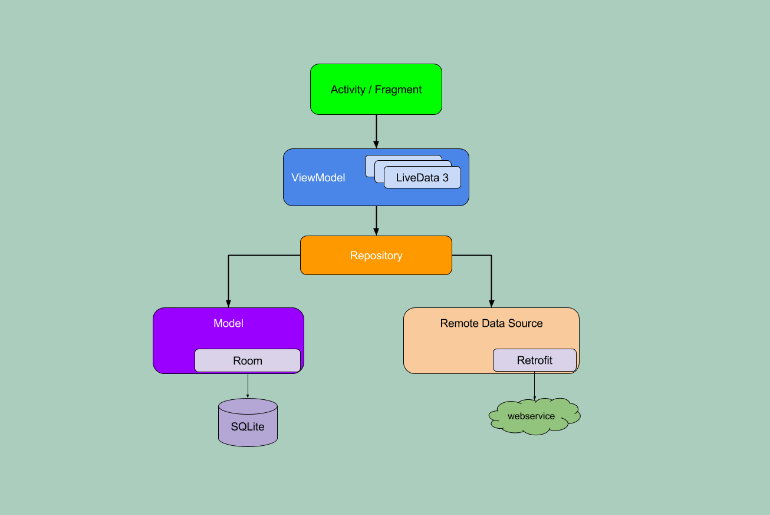

# MVVM arquitectura Android

---

## Introducción

El objetivo de esta app es describir las diferentes clases y como se interrelacionan para el [modelo MVVM](https://developer.android.com/topic/libraries/architecture/viewmodel?hl=es-419)

Una buena guía es [esta](https://developer.android.com/codelabs/kotlin-android-training-live-data#0).

## Escenario
Tenemos nuestra aplicación diseñada y codificada y queremos transformarla a la arquitectura MVVC, separar el manejo de datos de la activity principal.

Además utilizar el patrón de diseño [Observer](https://es.wikipedia.org/wiki/Observer_(patr%C3%B3n_de_dise%C3%B1o))

## Esquema general



## Configuración Gradle

Añadimos las siguientes dependencias

```
dependencies {
(...)
  // para instanciar ViewModel en la Activity
  implementation "androidx.fragment:fragment-ktx:1.5.4"
  // para los observables
  implementation 'androidx.lifecycle:lifecycle-livedata-ktx:2.5.1'
}
```

Necesitamos que la compilación sea compatible con Java 1.8, si no, nos puede dar este [error](https://stackoverflow.com/questions/48988778/cannot-inline-bytecode-built-with-jvm-target-1-8-into-bytecode-that-is-being-bui).

Recuerda que Kotlin compila Java. Para esto lo tenemos que configurar en el mismo fichero build.gradle en la sección, añadimos:

```
android {
    (...)
    compileOptions {
        targetCompatibility JavaVersion.VERSION_1_8
    }
    kotlinOptions {
        jvmTarget = "1.8"
    }
```

---

## Código
La clase ```MyViewModel``` va a ser la responsable de manejar los **datos** de nuestra aplicación.

Necesariamente no pondremos nada en esta clase referida a nuestra UI (interfaz de usuario), esto lo seguiremos haciendo en nuestra activity principal.

Como se ve en el código vamos a usar una [lista mutable](https://developer.android.com/codelabs/basic-android-kotlin-training-lists?hl=es-419#2): ```numbers```, para guardar varios enteros.

Todo los cambios de esta lista lo haremos en esta clase ```MyViewModel```.

```
// definimos la lista mutable
val numbers = MutableLiveData<Int>()
```

La clase de ```numbers``` es ```mutableList```, es una lista de enteros que podemos modificar

Para poder observar ```numbers``` definimos otra variable: ```livedata_numbers```

Esta variable será la que 'contenga' y dispare los cambios de ```numbers```

Implementa un par de métodos y extiende de ```MutableLiveData``` (que es una clase abstracta y no la podemos usar directamente).

Esta clase me permite hacer un **observable**.

---

Haremos la actualización del dato cada vez que le demos click al botón.

Esto lo haremos en la clase pricipal, en el listener del botón.


Primero vamos a instanciar este ```ViewModel``` en la activity principal:

```
val miModelo by viewModels<MyViewModel>()
```

La instancia se llama **miModelo**. El uso de *by* en Kotlin es lo que se llama delegación de propiedades.

En el listener del botón (o sea, cuando el usuario haga *click*) llamaremos a la función que modifica la lista:

```
miModelo.sumarRandom()
```

Entonces, el ViewModel añadirá un random a la lista y actualizará el valor del livedata:

```
// añadimos entero random a la lista
numbers.add(Random.nextInt(0,4))
// actualizamos el livedata, de esta manera si hay un observador
// este recibirá la nueva lista
livedata_numbers.setValue(numbers)
```

Cuando hacemos el ```setValue```, el observer (en la MainActivity) recibe el valor (en nuestro caso una ```MutableList```)

```
Observer(
  // funcion que llamaremos cada vez que cambie el valor del observable
  fun(nuevaListaRandom: MutableList<Int>)
```

Ya puedo actualizar el texto del ```TextView``` (```textRandom```) con la lista recibida (```nuevaListaRandom```)

```
textRandom.text = nuevaListaRandom.toString()
```

Ciclo terminado

---